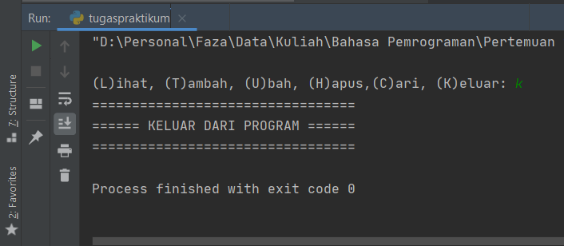

# labspy05

## Tugas Praktikum 5

Setelah tugas praktikum 4, maka lanjut untuk tugas praktikum 5
Bila di tugas 4 membuat data mahasiswa dengan list, di tugas 5 ini akan membuat data mahasiswa dengan ***dictionary*** yang kita dapat menambah, mengubah, dan menghapus datanya.

Sebelum ke tugas praktikum, adapun tugas latihan, berikut adalah latihannya

### Latihan

Pada latihan ini saya disuruh membuat dictionary daftar kontak, lalu disertai cara untuk menambah, mengubah, menampilkan key, values & item tersebut, dan menghapus<br>

Berikut adalah soal latihannya<br>
<br>

Untuk source codenya <br>
 <br>

###Tugas Praktikum

Untuk tugas praktikum 5 ini, tugasnya membuat program daftar nilai mahasiswa sederhana yang bisa ditambah, dihapus, diubah, dilihat dan dimasukkan kedalam tabel, & keluar dari program tersebut

Berikut untuk flowcartnya <br>

Tugas 5<br>
<br>

Output pada tugas :<br>
    *  Jika sebelum kita memasukkan data mahasiswa, bila kita ingin melihat tabel maka outputnya seperti ini
  <br>
     
* <br>
   Untuk output selanjutnya menggunakan tabel

Untuk source code nya
```python
data = {}
while True:
    print("")
    x = input("(L)ihat, (T)ambah, (U)bah, (H)apus, (C)ari, (K)eluar: ")
    if x.lower() == "l":
        if data.items():
            print("================================== Daftar Nilai ======================================")
            print("======================================================================================")
            print("|  No  |      NIM      |      NAMA         |    TUGAS   |   UTS   |   UAS   | AKHIR  |")
            print("======================================================================================")
            i = 0
            for x in data.items():
                i += 1
                print("| {6:4} | {0:13s} | {1:17} | {2:10d} |  {3:6d} | {3:7d} | {5:6.2f} | " \
                      .format(x[0], x[1][0], x[1][1], x[1][2], x[1][3], x[1][4], i))
        else:
            print("===================================== Daftar Nilai ===================================")
            print("======================================================================================")
            print("|  No  |      Nama     |      NIM      |   TUGAS  |   UTS   |   UAS   | Nilai Akhir  |")
            print("======================================================================================")
            print("|                                    Tidak Ada Data                                  |")
        print("======================================================================================")
    elif x.lower() == "t":
        print("Tambah Data")
        nama = input("Nama\t\t: ")
        nim = int(input("NIM\t\t\t: "))
        tugas = int(input("NIlai Tugas\t: "))
        uts = int(input("Nilai UTS\t: "))
        uas = int(input("Nilai UAS\t: "))
        nilaiakhir = ((tugas) * 0.3 + (uts) * 0.35 + (uas) * 0.35)
        data[nama] = nim, tugas, uts, uas, nilaiakhir
    elif x.lower() == "u":
        print("===============================")
        print("===Edit Data Nilai Mahasiswa===")
        print("===============================")
        nama = input("Masukan Nama\t\t: ")
        print("===============================")
        if nama in data.keys():
            nim = input("NIM baru\t\t\t: ")
            tugas = int(input("Nilai Tugas Baru\t: "))
            uts = int(input("Nilai UTS Baru\t\t: "))
            uas = int(input("Nilai UAS Baru\t\t: "))
            nilaiakhir = ((tugas) * 30 / 100 + (uts) * 35 / 100 + (uas) * 35 / 100)
            data[nama] = nim, tugas, uts, uas, nilaiakhir
            print()
            print("================================")
            print("=====BERHASIL MENGUBAH DATA=====")
            print("================================")
        else:
            print("Data nilai {0} tidak ada ".format(nama))
    elif x.lower() == "h":
        print("Hapus Data Nilai Mahasiswa")
        nama = input(" Masukan Nama\t:")
        if nama in data.keys():
            del data[nama]
            print()
            print("================================")
            print("====BERHASIL MENGHAPUS DATA====")
            print("================================")
        else:
            print("Data {0} tidak ada".format(nama))
    elif x.lower() == "c":
        print("Cari Data Nilai Mahasiswa")
        nama = input("Masukan Nama\t: ")
        if nama in data.keys():
            print("============================ Daftar Nilai ========================================")
            print("==================================================================================")
            print("====================| NAMA | (NIM, TUGAS, UTS, UAS, NILAI AKHIR) |================")
            print("==================================================================================")
            print("                    | {0} | {1} | ".format(nama, data[nama]))
            print("==================================================================================")
        else:
            print("Datanya {0} tidak ada ".format(nama))
    elif x.lower() == "k":
        print()
        print("=================================")
        print("====== KELUAR DARI PROGRAM ======")
        print("=================================")
        break

    else:
        print("Pilih Menu Yang Tersedia")
```

**Penjelasan :**

Program ini dibuat dengan ***Dictionary***, dengan pilihan melihat, menambahkan, mengubah, menghapus, mencari & keluar dari program.

* **Membuat menu pilihan**<br>
    Untuk membuat pilihan saya menggunakan perulangan **while true** 
    ```python
    data = {}
    while True:
        print("")
        x = input("(L)ihat, (T)ambah, (U)bah, (H)apus,(C)ari, (K)eluar: ")
    ``` 
  * **data = {}**, membuat dictionary kosong<br>
  * **x = input**, untuk menampilkan opsi pilihan<br>
  
* **Melihat data**<br>
    Karena menggunakan perulangan **while true**, dan ada banyak pilihan, maka disini menggunakan **if, elif & else**<br>
    Setelah muncul menu, maka bila kita masukkan menu **l** atau Lihat
    agar bisa memunculkan tabel, maka berikut source codenya
    ```python
    if x.lower() == "l":
        if data.items():
            print("================================== Daftar Nilai ======================================")
            print("======================================================================================")
            print("|  No  |      NIM      |      NAMA         |    TUGAS   |   UTS   |   UAS   | AKHIR  |")
            print("======================================================================================")
            i = 0
            for x in data.items():
                i += 1
                print("| {6:4} | {0:13s} | {1:17} | {2:10d} |  {3:6d} | {3:7d} | {5:6.2f} | " \
                      .format(x[0], x[1][0], x[1][1], x[1][2], x[1][3], x[1][4], i))
        else:
            print("===================================== Daftar Nilai ===================================")
            print("======================================================================================")
            print("|  No  |      Nama     |      NIM      |   TUGAS  |   UTS   |   UAS   | Nilai Akhir  |")
            print("======================================================================================")
            print("|                                    Tidak Ada Data                                  |")
        print("======================================================================================")
    ```
  * **x.lower()**, berfungsi apabila kita memasukkan huruf L besar(kapital) maka akan otomatis terbaca menjadi huruf kecil, jadi agar tidak ada error apalabila kita memasukkan huruf besar maupun kecil, maka bila ditambahkan menjadi **if x.lower() == "l":** dia akan menampilkan list <br>
  * Di pilihan **"l"** ada 2 output, yaitu output dengan data dan output tanpa data, bila kita belum memasukkan data apapun dan kita memilih menu **lihat** atau **"l"** maka outputnya akan seperti berikut <br>
   <br>
  tapi bila sudah ada data maka data akan ditampilkan seperti ini<br>
  
  * Karena ada 2 output dalam pilihan **"l"** maka menggunakan **"if"** & **"else"**
  * **print("| {6:4} | {0:13s} | {1:17} | {2:10d} |  {3:6d} | {3:7d} | {5:6.2f} | "**, berfungsi untuk membuat spasi atau jarak lalu di ikuti dengan **.format(x[0], x[1][0], x[1][1], x[1][2], x[1][3], x[1][4], i))**, untuk menampilkan data yang telah di input<br>
  
* **Menambah Data**<br>
    Untuk pilihan menambah data maka berikut adalah source codenya
    ```python
        elif x.lower() == "t":
            print("Tambah Data")
            nama = input("Nama\t\t: ")
            nim = int(input("NIM\t\t\t: "))
            tugas = int(input("NIlai Tugas\t: "))
            uts = int(input("Nilai UTS\t: "))
            uas = int(input("Nilai UAS\t: "))
            nilaiakhir = ((tugas) * 0.3 + (uts) * 0.35 + (uas) * 0.35)
            data[nama] = nim, tugas, uts, uas, nilaiakhir
    ```
  * Karena di pilihan menu melihat sudah menggunakan **if**, maka disini menggunakan **elif** dan seterusnya sampai di pilihan terakhir baru menggunakan **else**<br>
  * Dipilihan tambah ini menggunakan input seperti biasa lalu pada akhiran input ditambahkan dibawahnya **data[nama] = nim, tugas, uts, uas, nilaiakhir**, untuk memasukkan semua inputan kedalam **dictionary**
  * Karena nilai akhir hanya perhitungan dari penggabungan 3 nilai, yaitu nilai tugas, uts dan uas maka diberikan rumus **((tugas) * 0.3 + (uts) * 0.35 + (uas) * 0.35)*, sesuai dengan ketentuan tugas yang diberikan
 * Untuk output programnya seperti berikut, saya mencoba memasukkan 2 data<br>
 <br>
  
* **Mengubah Data**<br>
    Pada pilihan ketiga yaitu mengubah data, disini saya akan membuat program ini bisa merubah data NIM dan nilai - nilai yang sudah di inputkan, berikut source codenya
     ```python
        elif x.lower() == "u":
            print("===============================")
            print("===Edit Data Nilai Mahasiswa===")
            print("===============================")
            nama = input("Masukan Nama\t\t: ")
            print("===============================")
            if nama in data.keys():
                nim = input("NIM baru\t\t\t: ")
                tugas = int(input("Nilai Tugas Baru\t: "))
                uts = int(input("Nilai UTS Baru\t\t: "))
                uas = int(input("Nilai UAS Baru\t\t: "))
                nilaiakhir = ((tugas) * 30 / 100 + (uts) * 35 / 100 + (uas) * 35 / 100)
                data[nama] = nim, tugas, uts, uas, nilaiakhir
                print()
                print("================================")
                print("=====BERHASIL MENGUBAH DATA=====")
                print("================================")
            else:
                print("Data nilai {0} tidak ada ".format(nama))
    ```
  * Pada pilihan merubah data ini didalamnya ada 2 output, yaitu bila kita benar memasukkan nama yang ada pada data, maka akan lansung melakukan perubahan data dengan syntax **if nama in data.keys():**, untuk memanggil data yang akan dirubah, lalu masukkan NIM dan nilai - nilai baru dengan kode inpuut seperti biasa dan outputnya akan seperti berikut<br>
  <br>
  Lalu kita lihat lagi tabelnya, maka datanya akan berubah<br>
  <br>
  * **print("Data nilai {0} tidak ada ".format(nama))**, berfungsi untuk apabila salah memasukkan nama yang tidak ada pada data maka akan keluar output<br>
  <br>
  
* **Menghapus Data**<br>
    Untuk menghapus data, maka berikut adalah source codenya
    ```python
        elif x.lower() == "h":
            print("Hapus Data Nilai Mahasiswa")
            nama = input(" Masukan Nama\t:")
            if nama in data.keys():
                del data[nama]
                print()
                print("================================")
                print("====BERHASIL MENGHAPUS DATA====")
                print("================================")
            else:
                print("Data {0} tidak ada".format(nama))
    ```
  * Disini juga akan ada 2 output, yaitu bila benar dalam memasukkan nama yang ada pada data, maka nama tersebut akan terhapus pada **dictionary** dengan syntax **if nama in data.keys(): del data[nama]** seperti diatas dan menggukan **if**<br>
  <bbr>
  * **print("Data {0} tidak ada".format(nama))**, berfungsi apabila salah dalam memasukkan nama, maka akan keluar output seperti ini<br>
  <br>
  * Bila kita lihat lagi pada tabel, maka data sudah terhapus<br>
  <br>.
  
* **Mencari Data**<br>
    Untuk mencari data, berikut source codenya 
    ```python
        elif x.lower() == "c":
            print("Cari Data Nilai Mahasiswa")
            nama = input("Masukan Nama\t: ")
            if nama in data.keys():
                print("============================ Daftar Nilai ========================================")
                print("==================================================================================")
                print("====================| NAMA | (NIM, TUGAS, UTS, UAS, NILAI AKHIR) |================")
                print("==================================================================================")
                print("                    | {0} | {1} | ".format(nama, data[nama]))
                print("==================================================================================")
            else:
                print("Datanya {0} tidak ada ".format(nama))
    ```
  * **if nama in data.keys():**, kode format untuk memanggil nama yang dicari dari **dictionary**, lalu diikuti dengan syntax **print("| {0} | {1} | ".format(nama, data[nama]))**, untuk menampilkan nama yang di cari<br>
  <br>
  * **print("Datanya {0} tidak ada ".format(nama))**, berfungsi untuk apabila salah memasukkan nama yang tidak ada pada data maka akan keluar output seperti berikut<br>
  <br>

* **Keluar dari Program**<br>
    Untuk keluar dari program, maka tambahka break pada pilihan keluar dari program
    ```python
        elif x.lower() == "k":
            print()
            print("=================================")
            print("====== KELUAR DARI PROGRAM ======")
            print("=================================")
            break
    ```
  
  
* **Kesalahan memasukkan pilihan**<br>
    Apabila salah dalam memasukkan pilihan maka akan balik lagi untuk memilih pilihan yang tersedia, agar program seperti itu maka cukup dengan **else**, berikut syntaxnya
    ```python
        else:
            print("Pilih Menu Yang Tersedia")
    ```
  

Sekian untuk Tugas 5<br>

**==================================================================**<br>
**========================= FAZA ARDAN KUSUMA ========================**<br>
**============================= 312010001 =============================**<br>
**============================== TA.20.B1 =============================**<br>
**============================ TERIMA KASIH ==========================**<br>
**==================================================================**